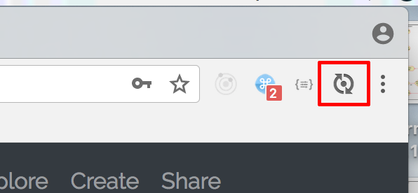

# Softwareengineering
This is our Software Engineering Project at the DHBW Karlsruhe.

## Our Team
* Florian as straub-florian
* Jonas as Toaster996
* Philipp as philipp7501

## Setting up the project
Simply add this project as a maven project to your IDE. 

**Project Folder:** 
   
    softwareengineering/DigitalJournal

After your _IDE_ has finished fetching all maven dependencies a new Run Configuration should appear. 
It is called **DigitalJournalApplication**.

###Additional requirements

####Lombok Plugin

Install the Lombok Plugin in your IDE. 
In IntelliJ go to
 * Help
 * find Action
 * search for _"Plugins"_ and  click on the result
 * Click on _browse repositories..._ at the bottom of the newly created window
 * Search for _Lombok Plugin_
 * Install it and restart

####Hot Swapping Code

In order to stop restarting the server by hand every time a change in code happens, the following needs to be done.

#####Live Reload

Install the [Live Reload](http://livereload.com/) plugin in your browser.

Make sure you enable it whenever you want to see live changes!

#####IDE Configuration

**_IntelliJ only!_**

Go to
  * Help
  * find Action
  * search for _"Settings"_ and  click on the result
  * go to **Build, Execution, Deployment**
  * then to **Compiler**
  * check _Build project automatically_
  
After that we need to go to the registry

In IntelliJ go to
  * Help
  * find Action
  * search for _Registry_ and click on the result
  * search for _compiler.automake.allow.when.app.running_ and set it to true
  
Now everything is done! :) 

