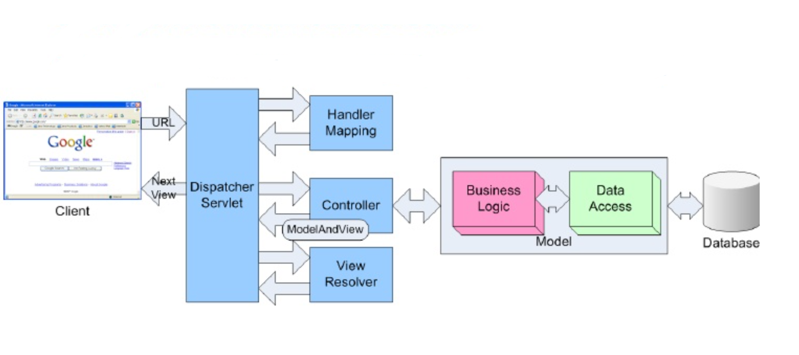
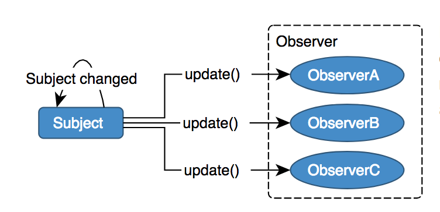
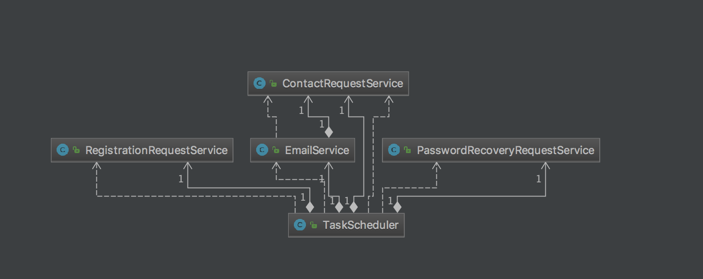
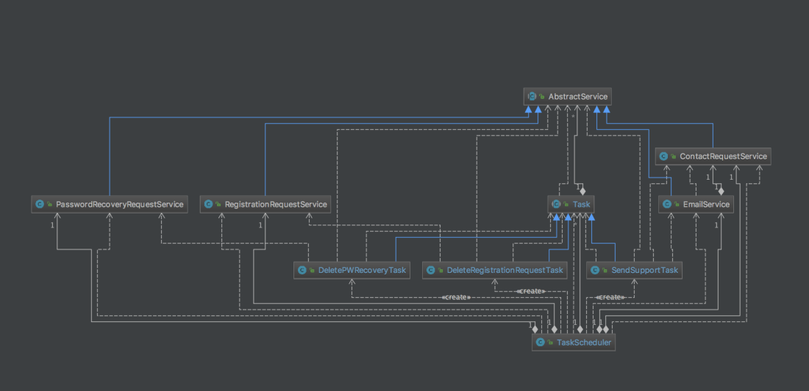
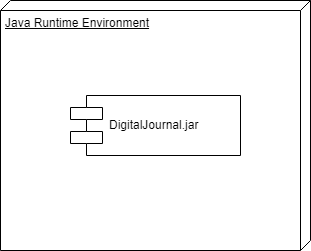
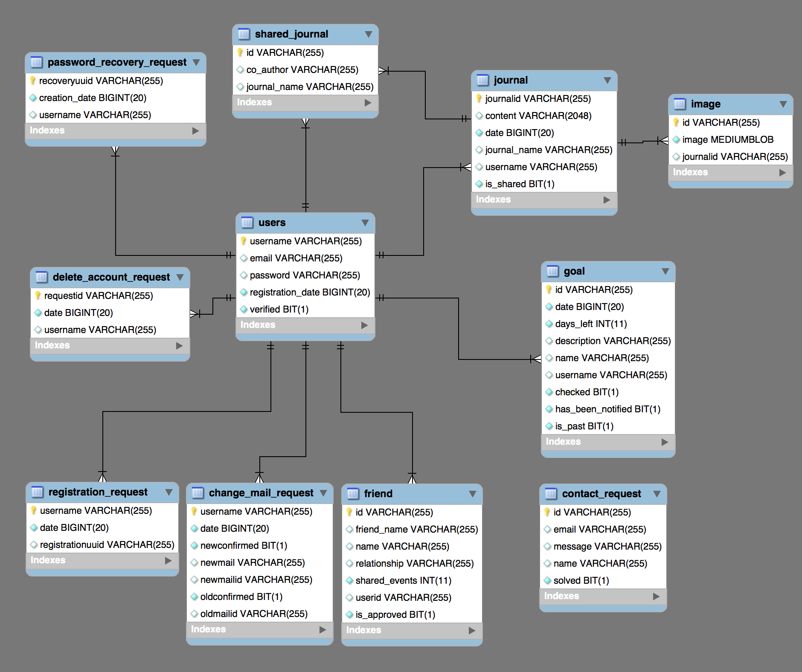

# Software Architecture Document
## 1. Introduction
### 1.1 Purpose
This document provides a comprehensive architectural overview of the system, using a number of different architectural views to depict different aspects of the system. It is intended to capture and convey the significant architectural decisions which have been made on the system.

### 1.2 Scope
The scope of this SAD is to show the architecture of the digital journal project. Affected are the class structure, the use cases and the data representation.

## 2. Architectural Representation

In principle, this is the architecture we want to use. Nevertheless, not all of our current classes follow this structure. In fact, we tend to have some BL implemented in Controllerclasses.

## 3. Architectural Goals and Constraints
To have all benefits of the MVC pattern, we decided to use Spring MVC 4.0 as MVC Framework. We are using Spring in the Backend and Frontend. To design our Views, we use Bootstrap, which is not part of this document.

## 4. User-Case View

See the [SRS](documentation.md) for further detail

## 5. Logical View
We took a look at our Class Diagram and highlighted Model and Controller Classes, aswell as the View Files.

Model = blue 
Controller = red
View = green

The View files are represented by HTML5 Files using [Thymeleaf](https://www.thymeleaf.org/). Note, that previous version of the DigitalJournal used JSP (Java Server Pages), which did not fullfill our satisfaction.

In our architecture we made use of patterns. One pattern we used was the Observer pattern. The Observer design pattern is suitable for situations where one or more objects need to be notified when the state of a particular object changes We implemented this design pattern in the task scheduler to keep everything organized and making it easy to add future tasks to the scheduler.

Before:

After:

## 7. Deployment View

As you can see deployment is pretty easy. For a complete tutorial please take a look at the [installation](https://github.com/Toaster996/softwareengineering/blob/master/documentation/Installation.md)

## 8. Implementation View

**n / a**

## 9. Data View
We are using a MySQL database to store user related data.
 

## 10. Size and Performance 

**n / a**

## 11. Quality 

**n / a**
