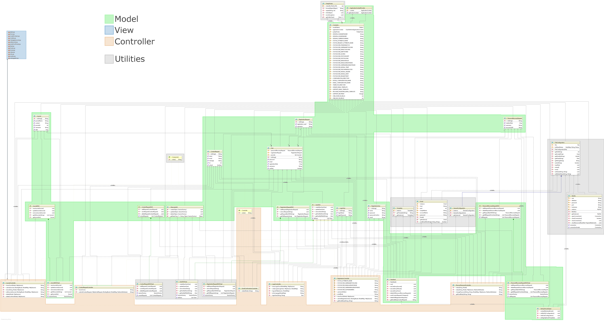
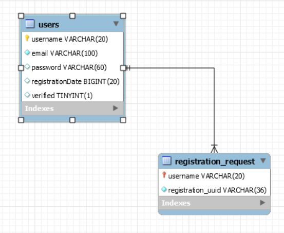

# Software Architecture Document
## 1. Introduction
### 1.1 Purpose
This document provides a comprehensive architectural overview of the system, using a number of different architectural views to depict different aspects of the system. It is intended to capture and convey the significant architectural decisions which have been made on the system.

### 1.2 Scope
The scope of this SAD is to show the architecture of the digital journal project. Affected are the class structure, the use cases and the data representation.

## 2. Architectural Representation

In principle, this is the architecture we want to use. Nevertheless, not all of our current classes follow this structure. In fact, we tend to have some BL implemented in Controllerclasses.

## 3. Architectural Goals and Constraints
To have all benefits of the MVC pattern, we decided to use Spring MVC 4.0 as MVC Framework. We are using Spring in the Backend and Frontend. To design our Views, we use Bootstrap, which is not part of this document.

## 4. User-Case View

See the [SRS](documentation.md) for further detail

## 5. Logical View
We took a look at our Class Diagram and highlighted Model and Controller Classes, aswell as the View JSP Files.

As you can see on the left handside, the view is represented by JavaServer Pages (.jsp). JSP-Files are basically standard HTML5 plus several scripting Tags. The most important one is `<% Content goes here %>`. You can also define other libraries and user further functionality like if and loops. Another nice feature is the easy partitioning of JSP-Files which we are using e.g. for our footer. 
## 7. Deployment View

As you can see deployment is pretty easy. For a complete tutorial please take a look at the [installation](https://github.com/Toaster996/softwareengineering/blob/master/documentation/Installation.md)

## 8. Implementation View

**n / a**

## 9. Data View
We are using a MySQL database to store user related data.
 

## 10. Size and Performance 

**n / a**

## 11. Quality 

**n / a**