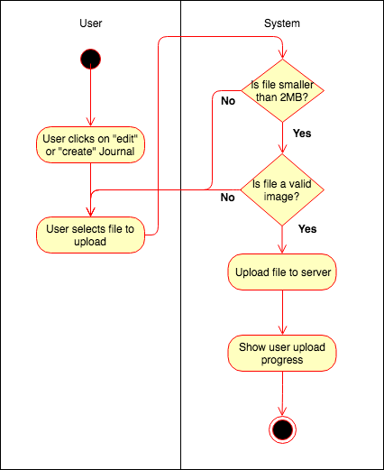
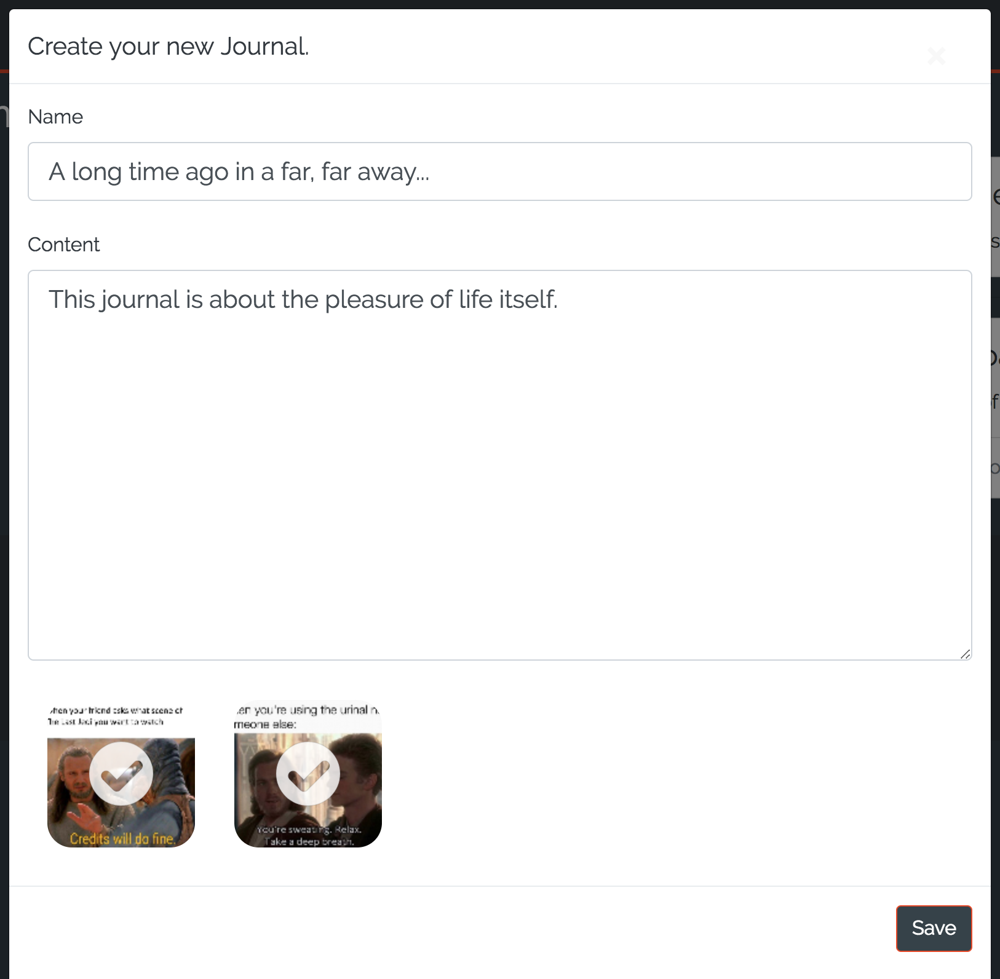
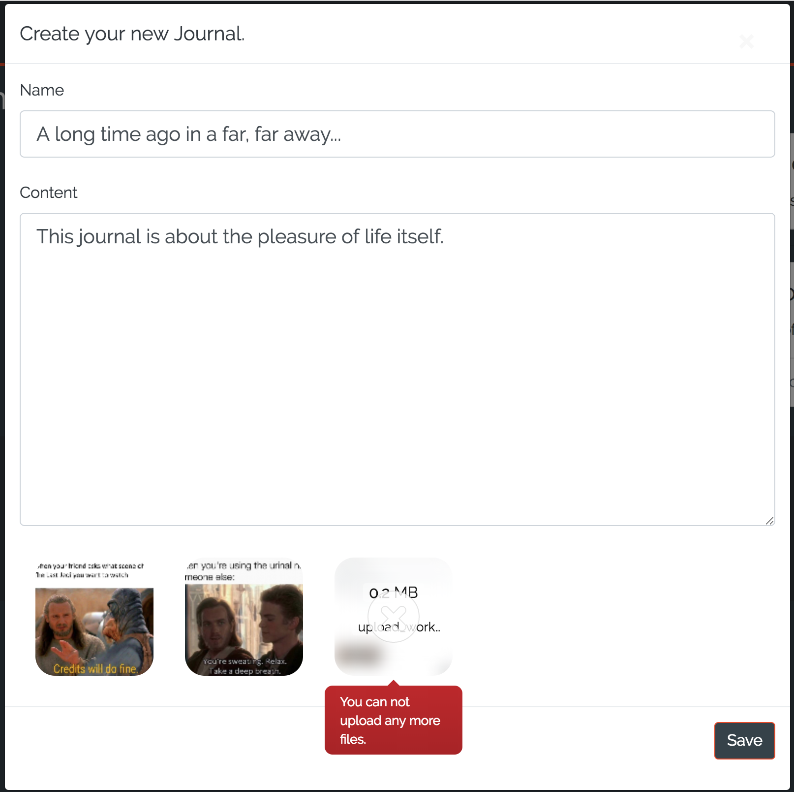
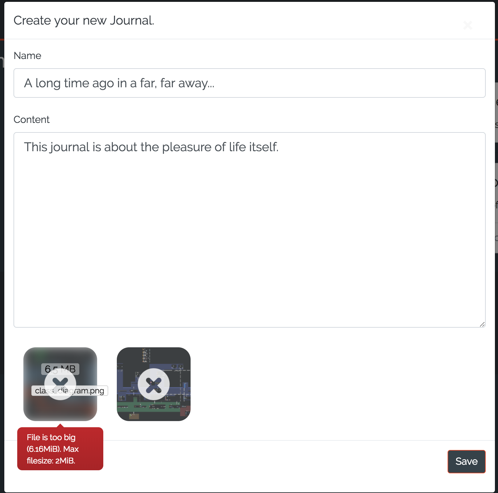

# DigitalJournal
## Use-Case Specification: Sign Up | Version 1.3

## 1. Use-Case: Sign Up

### 1.1 Brief Description

The use case describes the procedure when a user wants to add media to his journal.
## 2. Flow of Events

### 2.1 Basic flow

The user wants to add one or two images to his journal. The images can be uploaded while creating a new Journal or while editing a existing one. The user can not exceed the upload limit of 2 images per journal. Also each image is limited to 2MB file size.

### 2.2 User uploads too many files

If the user adds to many files, only the first two not ignored images will be uploaded.

### 2.3 User uploads too large files

If the user adds to large files, the file will be shown but ignored.

### 2.4 User adds no files

The user does not have to add files to his journals. Therefor he can ignore an image upload if he wants. 

## 3. Special Requirements

**n / a**

## 4. Preconditions

### 4.1 The user has to be logged in

In order to add media to a journal, a user has to be logged in.

## 5. Postconditions

### 5.1 Uploaded images

After a successful upload of the images, those images will be added to the journal once the user hits the Save button. If the user cancels his request (creating or editing a journal) the files will be deleted.
