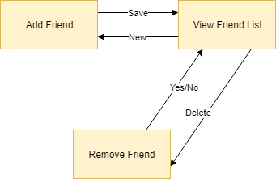
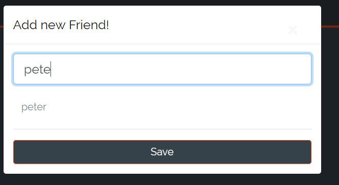
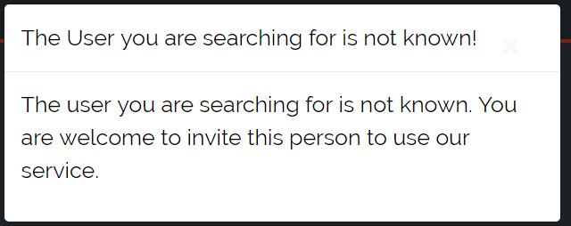
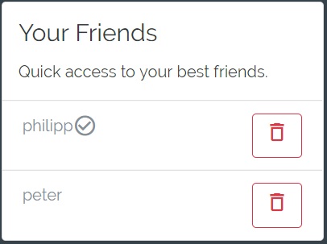

# DigitalJournal
## Use-Case Specification: CRUD Friend  v. <1.0>

## 1. Use-Case CRUD Friend

### 1.1 Brief Description
In our digital journal a user is able to add, view and remove friends. Friends are required for sharing of journals.
You can add a friend simply by typing in his name and clicking on add. If both added each other as friends the freindship is mutual and the sharing of journals is possible. Friends can be removed any time.

## 2. Flow of Events

### 2.1 Basic flow

In general a user will add multiple friends while using our service. These can be viewed in the friend list. Of course you can remove friends again.

### 2.2 Friend add

In order to add a friend the user has to click on the plus and then add friend 
He then can add a user by his name. If the user is valid it will appear in the friendlist. If not an error is displayed.

### 2.3 Friendlist

Of course you want to be able to keep track of your friends. therefore we added a friendlist with all your friends.

The checkmark behind the name indicates the friendship is mutual. 

### 2.4 Friend removal

Removing a friend is easy. Simply click on the trash can behind the name.

## 3. Special Requirements

### 3.1 Owning An Account
        
In order to have friends the user has to have an account. Only if he has one, he will be able to use the friend features.

## 4. Preconditions

### 4.1 The user has to be logged in

To ensure proper privacy of journals the user has to be logged in when working with friends.

## 5. Postconditions

### 5.1 Friend add

After adding a friend the user is marked as a friend in the list. If both added each other the friendship is mutual and sharing of journals is possible.

### 5.2 Friendlist

**n / a** 

### 5.3 Friend removal

After clicking on the trash can the user will be removed from your friendlist. If the friendship was mutual you will stay in the friendlist of you former friend but you will no longer be marked as a mutual friendship.

## 6. Extension Points

**n / a**