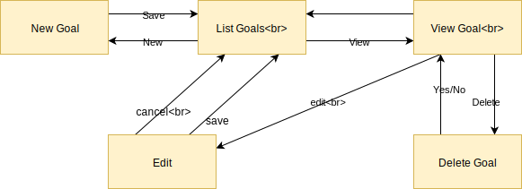

# DigitalJournal
## Use-Case Specification: CRUD Goals | Version 1.0

## 1. Use-Case CRUD Goals

### 1.1 Brief Description

Our Digital Journal will offer the user to work with goals. Goals are created by the user and have a due date when they are bond to be finished. A user an create, view, delete and modify a goal accroding to his needs. 

## 2. Flow of Events

### 2.1 Basic flow

In general a user will create a goal. Maybe he will edit it later and maybe if it is no longer valid for the user he deletes it.

### 2.2 Creation  

The creation of the goal will need a goal name, a description and a due date.

### 2.3 Edit

During the edit the user will be able to change the due date, as well as the name and description. If he decides to change the date he will be asked with a popup if he really wants to do that as goals are designed to be finished by a date that does not change often.

### 2.3 List

The user wants to be able to view all of his goals to keep track of what he wanted to achieve

### 2.4 Delete

Even though a goal is something you should not delete that easily we still provide the possibility. The user will be asked if he really wants to delete that goal. 

## 3. Special Requirements

### 3.1 Owning An Account
        
In order to create a goal the user has to have an account. Only if he has one he will be able to manage goals.

## 4. Preconditions

### 4.1 The user has to be logged in

To ensure proper privacy of goals the user has to be logged in when working with goals.

## 5. Postconditions

### 5.1 Create

After creating the new goal the user will be redirected to the list overview, where the new entry will already be displayed

### 5.2 Edit

After the user saved his edits, the updated data will be displayed in the list overview.

### 5.3 Delete

After confirming the deletion modal, the goal will be permanently removed and no longer displayed in the overview.

## 6. Extension Points

**n / a**