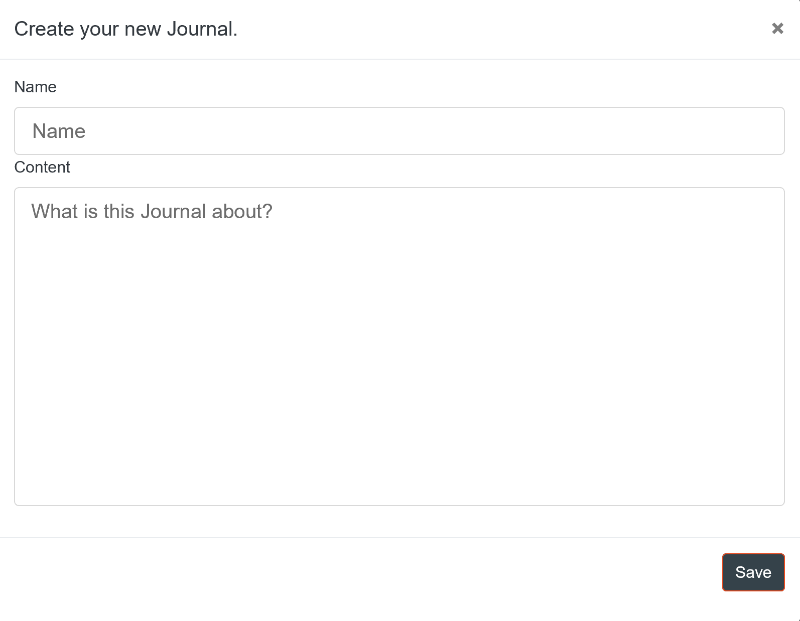
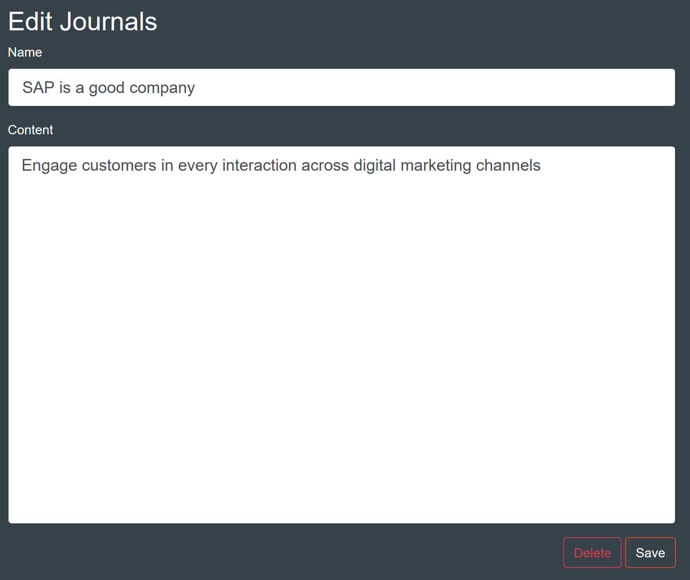

# DigitalJournal
## Use-Case Specification: Create Journal | Version 1.1

## 1. Use-Case: Create Journal

### 1.1 Brief Description

This use case describes the creation, reading, updating and deleting of Journals (CRUD).

## 2. Flow of Events

### 2.1 Basic flow

In general a user will create a journal and list all of his journals. He will maybe edit it later and from time to time he will delete journals.

### 2.2 Creation  

The creation of a new Journal. The user will be asked to enter a name, and a text.

### 2.3 Edit

During editing the user can modify the name and the content of the journal.

### 2.3 List

The user wants to be able to view all of his journals. Therefore he is presented a list with all entries.

### 2.4 Delete

Of course the user wants to be able to delete journals. Therefore we added a button in the edit page to delete an entry. To ensure he does not delete a journal on accident we added a modal asking if he really wants to do this.

## 3. Special Requirements

### 3.1 Owning An Account
        
In order to create a new journal the user has to have an account. Only if he has one, the dialog of a creation of a journal will be visible.

## 4. Preconditions

### 4.1 The user has to be logged in

To ensure proper privacy of journals the user has to be logged in when working with journals.

## 5. Postconditions

### 5.1 Create

After creating the new journal the user will be redirected to the list overview, where the new entry will already be displayed

### 5.2 Edit

After the user saved his edits, the updated data will be displayed in the list overview.

### 5.3 Delete

After confirming the deletion modal, the journal will be permanently removed and no longer displayed in the list overview.

## 6. Extension Points

**n / a**