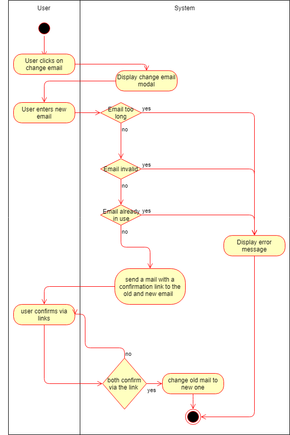
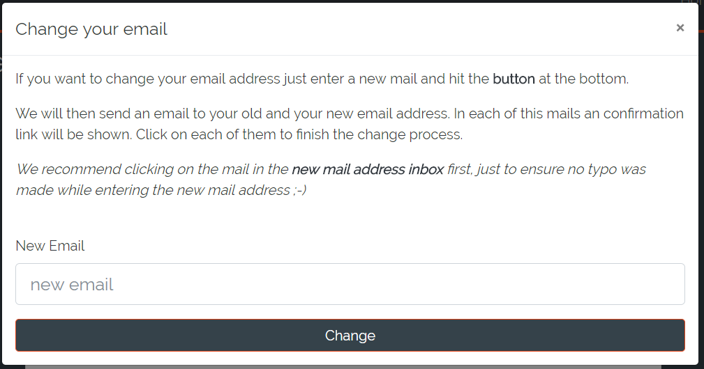
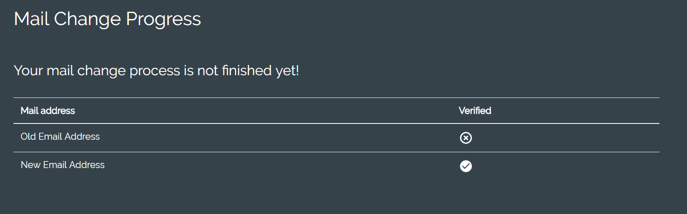
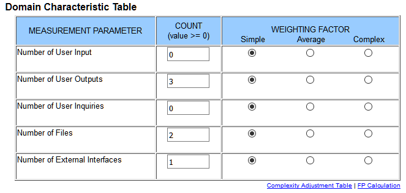

# DigitalJournal
## Use-Case Specification: Change Account Email | Version 1.3

## 1. Use-Case: Change Account Email

### 1.1 Brief Description

The use case describes the procedure when someone wants to alter his email address.

## 2. Flow of Events

### 2.1 Basic flow

The basic flow of this usecase is that the user visits his profile page to change his email address. He will enter a valid new email address and click on the links in the email he receives. His email will then be changed.

### 2.2 The email the user provided is wrong.

The email the user entered into the field could be wrong. He will then be notified that this was not a valid email.

### 2.3 The email the user provided is too long

As we are storing emails in the database they are limited to a certain size. If this size is exceeded the user will be informed.

### 2.4 The email the user provided could already be in use

Every email address can only be used once. If the user enters a email that is already assigned to an account he will be given a message.

## 3. Special Requirements

### 3.1 Email address

In order to send a contact request the user needs two valid email addresses. (old one and the new one)

## 4. Preconditions

### 4.1 The user has to be logged in

The user has to be logged in when altering his account details.

## 5. Postconditions

### 5.1 The user has a new mail

After changing his email successfully the users old email gets overridden by his/her new email.

## 6. Function Points

To calulate the function points for a specific use case we used the [TINY TOOLS FP Calculator](http://groups.umd.umich.edu/cis/course.des/cis525/js/f00/harvey/FP_Calc.html).

    Score:      27,28 Function Points. 
    Estimation: 6h 37m.

