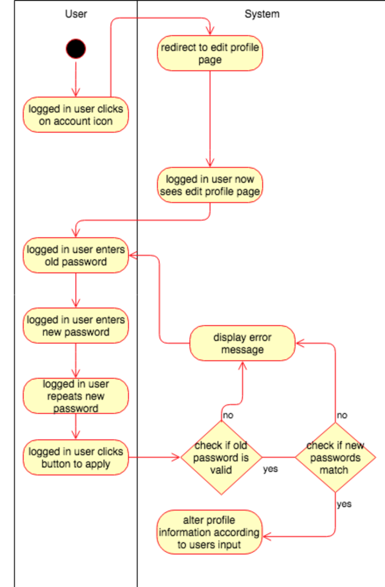
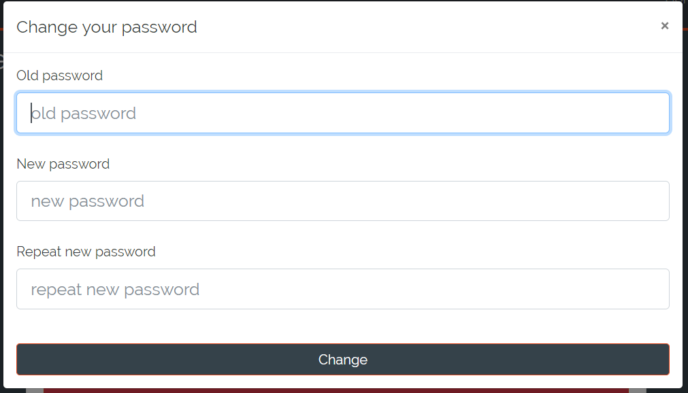
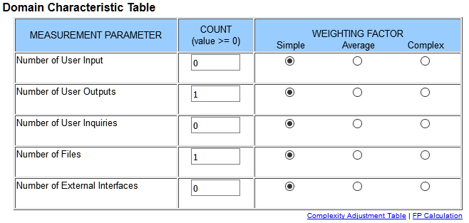

# DigitalJournal
## Use-Case Specification: Change Account Password | Version 1.3

## 1. Use-Case: Change Account Password

### 1.1 Brief Description

The use case describes the procedure when someone wants to change his password.

## 2. Flow of Events

### 2.1 Basic flow

The basic flow of this usecase is that the user visits his profile page to change his password. He needs to provide his old password, a new password. He also needs to repeat the new password to minimize the chance of a unrecognized typo happening. After the system checked the old password is true and the new password matches with the repeated one, the users password gets updated in the database.    

### 2.2 Old password is wrong

The user gets prompted to enter the correct password if the entered one was incorrect.

### 2.3 New password too short

To ensure a secure journal the minimum password length is 6 characters. If a user tries to create an account with a shorter password a message will be displayed. 

### 2.4 New password too long

The maximum password length is 42. If the user entered a password longer than 42 a message is displayed stating the password is too long.

 

### 2.5 The passwords do not match

If the entered passwords do not match the user has to reenter them.

 

## 3. Special Requirements

**n / a** for this point

## 4. Preconditions

### 4.1 The user has to be logged in

To ensure proper privacy of journals the user has to be logged in when altering his account details.

## 5. Postconditions

### 5.1 The user has a new passowrd

The users password will be changed after a successful execution of the process of altering your password. 

## 6. Function Points

To calulate the function points for a specific use case we used the [TINY TOOLS FP Calculator](http://groups.umd.umich.edu/cis/course.des/cis525/js/f00/harvey/FP_Calc.html).

    Score:      9,68 Function Points. 
    Estimation: -3h 42m.

