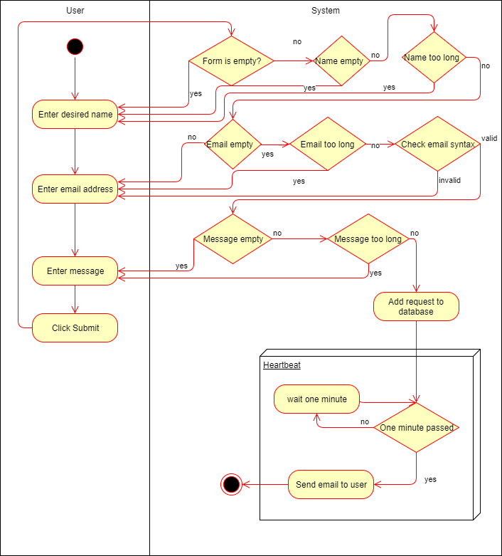

# DigitalJournal
## Use-Case Specification: Sign Up | Version 1.3

## 1. Use-Case: Sign Up

### 1.1 Brief Description

The use case describes the procedure when someone has an issue and wants to contact DigitalJournal. 

## 2. Flow of Events

You can see the .feature file that describes this Use-Case [here](https://github.com/Toaster996/softwareengineering/blob/master/DigitalJournal/src/test/resources/features/ContactUs.feature) or on the screenshot below:

### 2.1 Basic flow

The basic flow of this usecase is that the user enters his name, his email and a his issue and then submits his contact request. This request then gets added to a queue which will be worked of every minute by the heartbeat service in order to send the mail to our support. 

### 2.2 Form is empty

The user did not fill in every entry in the form. A message that the Form is empty will be displayed.

### 2.3 Name too long

The Names are restricted to 50 characters. Longer names will not be accepted.

### 2.4 Email too long

The email has a maximum size of 100 characters. If a user tries to enter a longer email he will be notified, that this is not possible.

### 2.5 Email invalid

The value entered into email has to have a correct syntax. If it does not a message will be displayed. The user has to reenter this value.

 

### 2.6 Message too long.

The message has a maximum size of 1000 characters. If a user tries to enter a longer email he will be notified, that this is not possible.

## 3. Special Requirements

### 3.1 Email address

In order to send a contact request the user needs a valid email so that the DigitalJournal-team can answer can him.

## 4. Preconditions

**n / a** for this usecase

## 5. Postconditions

**n / a** for this usecase

## 6. Extension Points

**n / a**