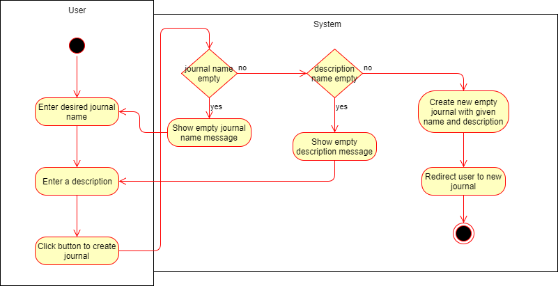
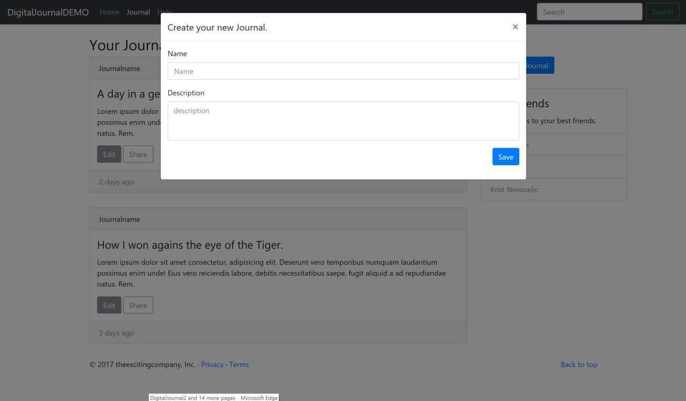
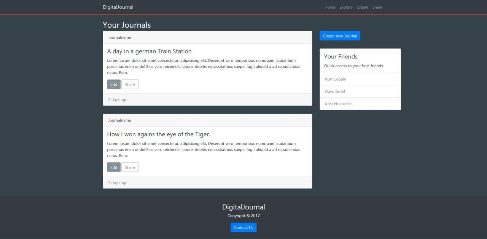
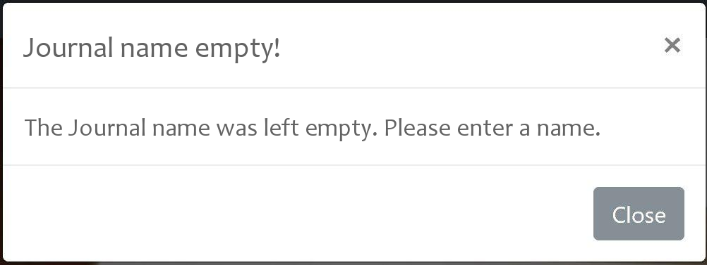
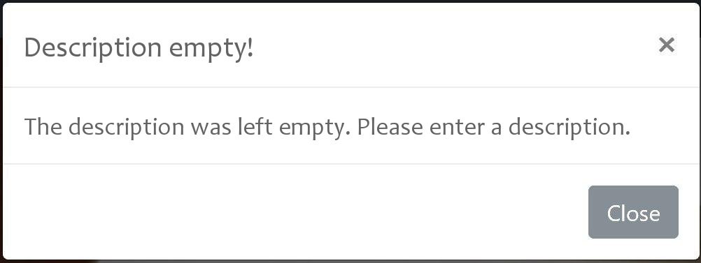

# DigitalJournal
## Use-Case Specification: Create Journal | Version 1.0

## 1. Use-Case: Create Journal

### 1.1 Brief Description

This use case describes the creation of a new journal entry.

## 2. Flow of Events

### 2.1 Basic flow

The basic flow of this usecase is that a user enters a journal name and a journal description and does neither leave the name nor the description empty. Afterwards he will be redirected to his newly created journal.

#### Creation Dialog 

#### Redirection to Your Journals

### 2.2 Journal name was left empty

The value entered into **Name** can not be null or empty. Therefor the user has to put a name in it. If he does not, a messagebox will pop up.

### 2.2 Description was left empty

The value entered into **Description** also has to have an value other than null or empty. A messagebox will pop up if it does not. 

## 3. Special Requirements

### 3.1 Owning An Account
        
In order to create a new journal the user has to have an account. Only if he has one, the dialog of a creation of a journal will be visible.

### 3.2 Being logged in

The user has to be logged into his account to create a journal.

## 4. Preconditions

### 4.1 Click on "Create new Journal" button

To create a new journal, the user has to click a button to launch the creation dialog.

## 5. Postconditions

### 5.1 A New Journal

After the creation of the new journal the user will be able to add new entries and edit it, as his entered information was added to the database and linked to his account. 

## 6. Extension Points

**n / a**