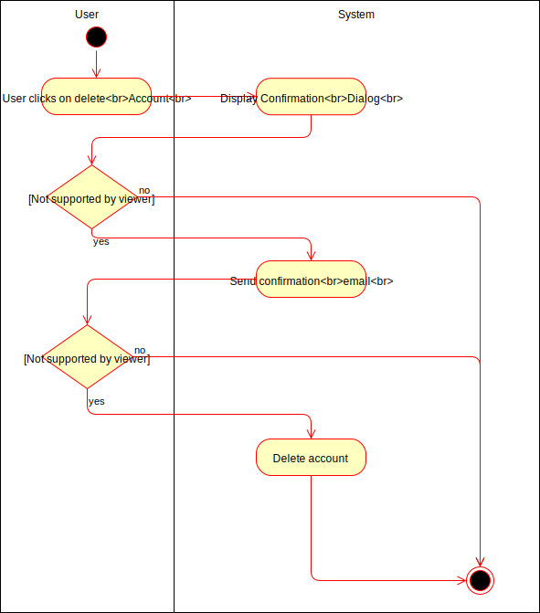
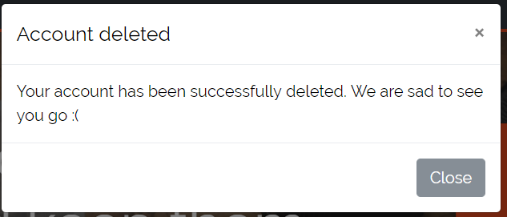
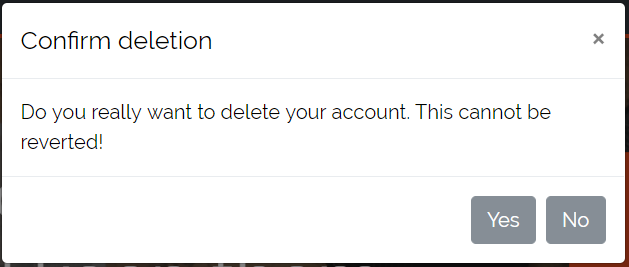

# DigitalJournal
## Use-Case Specification: Delete Account | Version 1.0

## 1. Use-Case Delete Account

### 1.1 Brief Description

Of course we want the user to be able to delete his account if he no longer plans on using our service. All information regarding the user will be deleted and cannot be restored.

## 2. Flow of Events

### 2.1 Basic flow

In general the user wants to delete his account. He will enter confirm the dialog and click on the link in the email within 1h. The account will then be completely deleted.

### 2.2 User does not confirm the dialog

If the user does not confirm the dialog the process will abort and no email will be sent. The account will not be deleted either.

### 2.3 The user confirms the dialog but does not click on the link

If the user confirms the dialog but does not click on the link in the email in time the process get canceled and the account will not be deleted.

## 3. Special Requirements

**n / a**

## 4. Preconditions

### 4.1 The user has to be logged in

In order to delete his account, a user has to be logged in.

## 5. Postconditions

### 5.1 Deleted account

After the successful confirmation all information connected to this account will be deleted. 

## 6. Extension Points

**n / a**