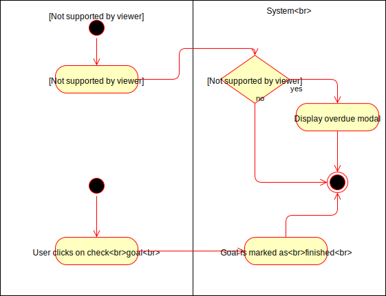
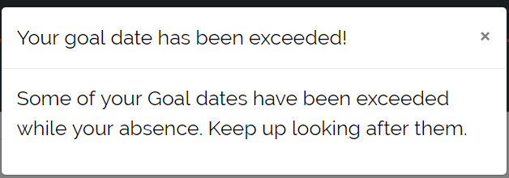
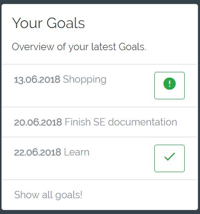

# DigitalJournal
## Use-Case Specification: Goal checking  v. <1.0>

Lorem Ispum...

## 1. Use-Case Goal Checking

### 1.1 Brief Description

Of course the user wants to be able to interact with goals. He needs to be able to mark goals as finished as well as being reminded if one goal is overdue.

## 2. Flow of Events

### 2.1 Basic flow

In general a user will create a goal and then mark it as finished later on. Sometimes he will forget about goals leading to a notification that a goal is overdue.

### 2.2 Goal notification  

If a user forgot to mark a goal as finished before the due date is reached, he will get a notification stating he has an overdue goal. Overdue goals are marked with an exclamation mark in the list.

### 2.3 Check goal

The user is able to check a goal marking it as finished by clicking on the checkmark. If a goal is finished it will no longer have any icon behind its name

## 3. Special Requirements

### 3.1 Owning An Account
        
In order to interact with a goal the user has to have an account. Only if he has one he will be able to check goals.

## 4. Preconditions

### 4.1 The user has to be logged in

To ensure proper privacy of goals the user has to be logged in when working with goals.

### 4.2 Already existing goals

In order to check goals or to be reminded the user has to have already created goals.

## 5. Postconditions

### 5.1 Goal notification

Goals which are overdue will be marked with an exclamation mark.

### 5.2 Goal checking

Goals which are checked are marked as done will no longer trigger a notification on the due date.

## 6. Extension Points

**n / a**