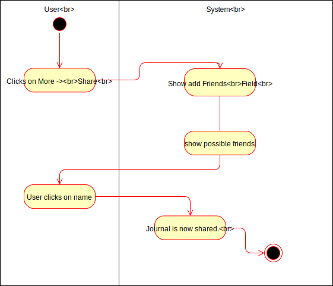
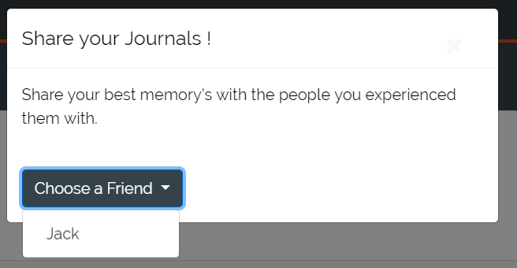
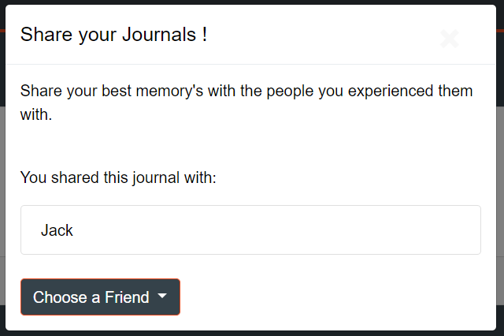

# DigitalJournal
## Use-Case Specification: Share Journal  v. <1.0>

## 1. Use-Case Share Journal

### 1.1 Brief Description

Our service provides you with the ability to share your journals with your friends. Did something together? Simply add them and they will see what you wrote.

## 2. Flow of Events

### 2.1 Basic Flow

The basic flow is that the user will share his journal with a mutual friend.

### 2.2 Successful sharing

By clicking on share in the journal the user will be given a modal for sharing this journal with friends. He will be given suggestions for who he can share them with.

## 3. Special Requirements

### 3.1 Owning An Account
        
In order to share journals the user has to have an account. Only if he has one he will be able to share journals.

## 4. Preconditions

### 4.1 The user has to be logged in

To ensure proper privacy of goals the user has to be logged in when working with goals.

### 4.2 Already having a friend

In order to share journals the user has to have at least one friend.

## 5. Postconditions

### 5.1 Successful sharing

The journal will be shared with the friend. He can then see it in his journal list without being able to modify it.

## 6. Extension Points

**n / a**