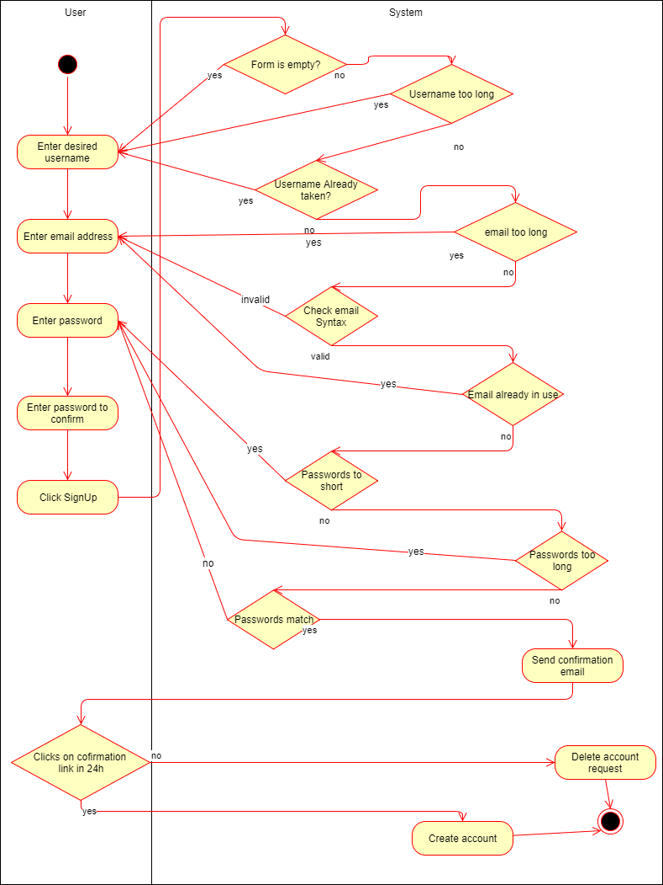
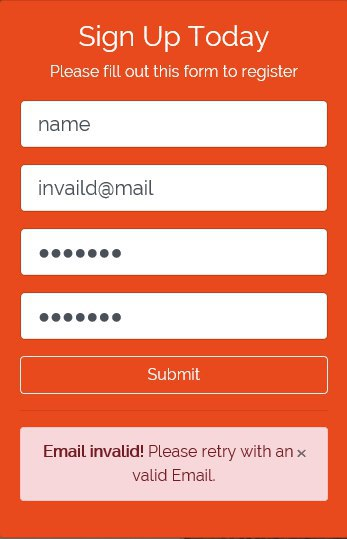
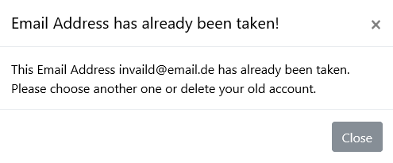
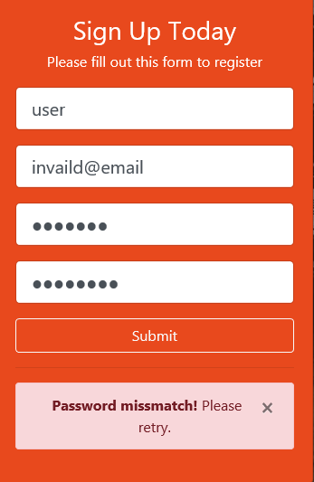

# DigitalJournal
## Use-Case Specification: Sign Up | Version 1.0

## 1. Use-Case: Sign Up

### 1.1 Brief Description

The use case describes the procedure when someone wants to create a new account in order to gain access to DigitalJournal.

## 2. Flow of Events

You can see the .feature file that describes this Use-Case [here](https://github.com/Toaster996/softwareengineering/blob/master/DigitalJournal/src/test/resources/features/SignUp.feature) or on the screenshot below:

### 2.1 Basic flow

The basic flow of this usecase is that the user enters his credentials, the email address is valid and not already in use and the passwords match. He will then receive an email with a link he needs to click withing 24h. If he does this the account is successfully created.

### 2.2 Form is empty

The user did not fill in every entry in the form. A message that the Form is empty will be displayed.

### 2.3 Username too long

### 2.4 Email invalid

The value entered into email has to have a correct syntax. If it does not a message will be displayed. The user has to reenter this value.

 

### 2.3 Email already in use.

If an account already exists with the given email address a message wil be displayed and the user has to enter another email address.

### 2.4 The passwords do not match

If the entered passwords do not match the user has to reenter them.

### 2.5 The user does not click on the link

The user entered everything correctly but does not click on the link in the email sent to him. After 24 hours the system will delete the data, invalidate the link and act like the user never has entered anything. No account will be created 

## 3. Special Requirements

### 3.1 Email address

In order to create an account the user has to have a valid email address which has not been used before.

### 3.1 Encrypted connection

As we are dealing with account information during this use case the connection has to be secured via ssh the whole time.

## 4. Preconditions

**n / a** for this usecase

## 5. Postconditions

### 5.1 Log in

After the successful sign up the user will be able to log in with his credentials, as his data is added to the database.

## 6. Extension Points

**n / a**