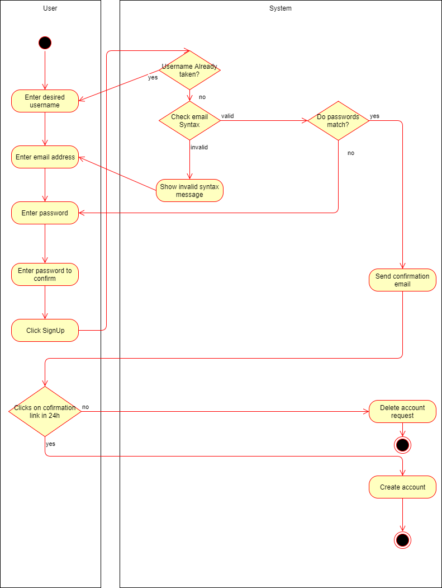

# DigitalJournal
## Use-Case Specification: Sign Up | Version 1.0

## 1. Use-Case: Sign Up

### 1.1 Brief Description

Will be added later...

## 2. Flow of Events

## 3. Special Requirements

### 3.1 Email address

In order to create an account the user has to have a valid email address which has not been used before.

### 3.1 Encrypted connection

As we are dealing with account information during this use case the connection has to be secured via ssh the whole time.

## 4. Preconditions

**n / a** for this usecase

## 5. Postconditions

### 5.1 Log in

After the successful sign up the user will be able to log in with his credentials, as his data is added to the database.

## 6. Extension Points

**n / a**