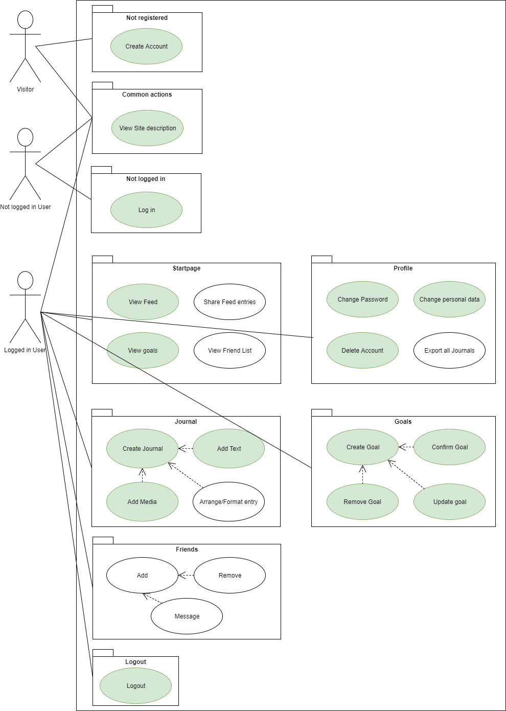

# Digital Journal - Software Requirements Specification

## 1. Introduction
### 1.1 Purpose
This SRS describes all specifications for the DigitalJournal Project by theExcitingCompany. This is a Web-App which allows users to write own journals or diary entries, save them to our secure cloud and access them from everywhere. One is also allowed to share this entries with friends. As our goal is to make peoples life better, we are also going to implement a goal system, where every user can set his own goals and track his way to achieve those. Due to the privacy of those information, we really keep an eye on encryption. 
###1.2 Scope
The DigitalJournal Project consist of two main parts. The Frontend development, which is done in HTML/CSS as well as JavaScript using _Bootstrap_ and the Backend, using a Model-View-Controller Framework _SpringMVC_ for Java.
###1.3 Definitions, Acronyms and Abbreviations
* **MVC** Model-View-Controller
* **Twitter-Bootstrap** Web-UI Framework using HTML, CSS and Javascript
* **UC** Use Case
* **UCD** Use Case Diagram
* **SRS** Software Requirements Specification
###1.4 References
| Title        | Date           |
| ------------- |-------------|
| [Unveiled Blog](https://theexcitingcompany.wordpress.com/)   | 04.10.2017 | 
_more coming soon..._

## 2. Definition
### 2.1 Vision
Our project is called Digital Journal. The goal of this project is to create a multimedial web based journal that can be accessed from everywhere with internet access. You don’t have to worry about losing your journal ever again.

Functionality: You will be able to create journal entries with pictures and videos which are connected to an account. As a journal is a very private thing security and privacy is a topic we will focus on. However you will be able to share certain journal entries with friends and send them messages if you choose to. To add gamification you will be rewarded with achievements if you reach certain criteria like uploaded 10 images or 20 entries in a row, that also can be shared. You will also be able to create your own goals and start documenting how you reach them.

The following picture shows the overall use case diagram of our software: 
=======

